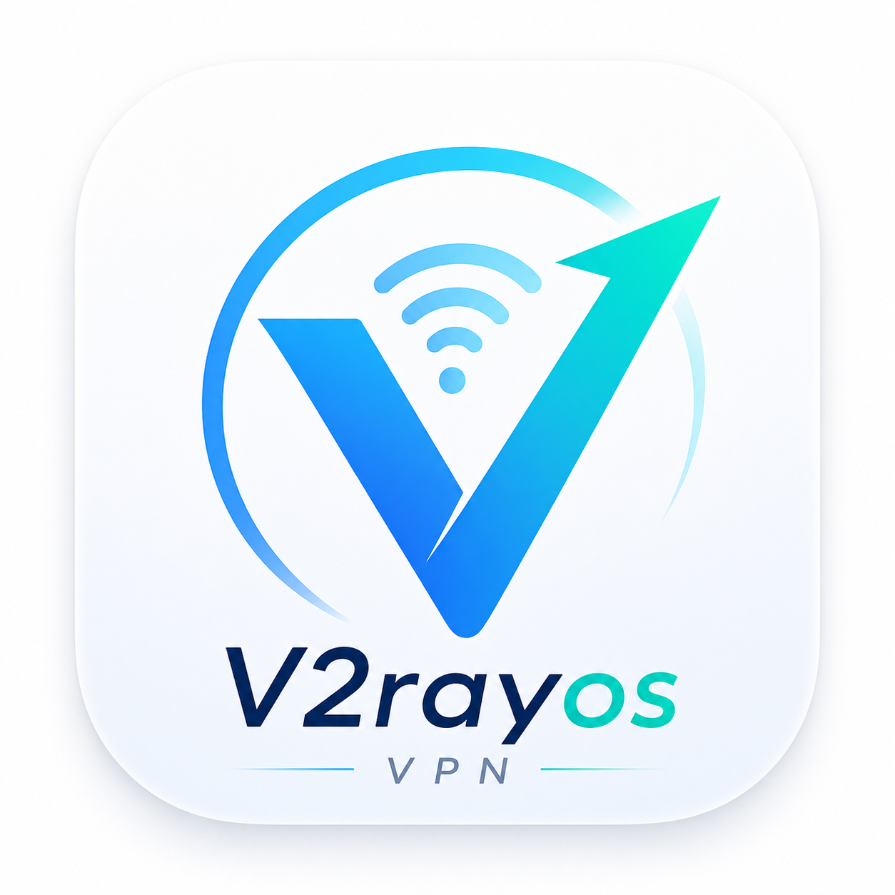

# V2raynos

<p align="center">
  
</p>

**iOS 端 v2rayNG 复刻**：Xray-core 内核 + hev-socks5-tunnel TUN 路由 + SwiftUI iOS 风格 UI。1:1 复刻 v2rayNG 的交互与功能，GitHub Actions 云端构建 `.ipa`（后期提供正式签名分发，当前为未签名构建产物）。

## 功能特性

- **内核**：Xray-core（AndroidLibXrayLite gomobile bind）+ hev-socks5-tunnel（TUN ↔ SOCKS5 桥接，含 lwip 协议栈）
- **协议**：VMess / VLESS / Shadowsocks / Trojan / Hysteria2 / WireGuard / Socks / HTTP
- **传输**：TCP / WS / gRPC / mKCP / HTTPUpgrade / XHTTP / H2；TLS / REALITY（SNI、Fingerprint、ALPN、allowInsecure）
- **UI 1:1 v2rayNG**：
  - 首页：左上角 APP 图标（点开抽屉）、左对齐标题「配置项」、🔍 搜索 / ➕ / ⋮ 三图标工具栏
  - 顶部横向分组栏（选中下划线高亮）
  - 节点卡片：名称 / 地址:端口 / 协议·传输·TLS + 分享、编辑、删除 + Ping 延迟
  - ➕ 菜单：扫描二维码 / 剪贴板导入 / 本地导入 / 添加 [VMess][VLESS][Shadowsocks][Trojan][Hysteria2][WireGuard]（分协议模板表单）
  - ⋮ 菜单：服务重启 / 删除配置 / 按测试结果排序 / TCPing / 真连接延迟 / 更新订阅
  - 底部：左下角连接状态文字 + 右下角圆形连接按钮（未连接灰 ▶ / 已连接绿 V）
  - 左侧抽屉：订阅分组 / 路由设置 / 资源文件 / 设置 / Logcat / 备份 & 还原 / 关于
- **节点管理**：分组（长按更新/重命名/删除）、订阅（添加/编辑/更新/全部更新/删除，自动建分组）、扫码（相机+相册）、剪贴板（http 链接自动走订阅）
- **延迟测试**：真连接测试（临时 Xray http 入站 → 代理访问 generate_204）+ TCPing 兜底
- **VPN 管理**：NETunnelProviderManager（loadAllFromPreferences → startVPNTunnel(options:)），Packet Tunnel 扩展 + KVC 桥接 TUN fd

## 系统要求

- iPhone / iPad，iOS 16.0+
- 首次启动 VPN 时系统会弹出「添加 VPN 配置」授权，允许即可

## 构建（GitHub Actions 云端，无需 Mac）

1. Fork / 推送本仓库到你的 GitHub
2. Actions 自动构建（`.github/workflows/ios-build.yml`），macos runner 流程：
   - `build_xray_ios.sh` → `frameworks/XrayCore.xcframework`（Xray-core gomobile bind）
   - `build_hev_ios.sh` → `frameworks/libhev-socks5-tunnel.a`（arm64）
   - `xcodegen generate` → 生成 `.xcodeproj`（App + PacketTunnel 双 target）
   - `xcodebuild CODE_SIGNING_ALLOWED=NO` → 未签名 `.app`
   - `build_ipa.sh` → `V2raynos-unsigned.ipa`（Artifact 下载）

构建约 5 分钟（Xray-core 首次约 25 分钟，之后有 go.mod 缓存）。

## 首次使用建议

1. 左侧抽屉 → 订阅分组 → 添加订阅 URL（自动建分组并拉取）
2. 首页点分组 → 测速（⋮ 菜单 → 测试真连接延迟）→ 选中延迟最低节点
3. 点右下角 ▶ 启动 VPN → 授权弹窗允许 → 状态变绿即代理生效

## 目录结构

```
V2raynos/
├── V2raynos/
│   ├── V2raynosApp.swift        # 入口
│   ├── ContentView.swift        # 抽屉容器
│   ├── Assets.xcassets/         # AppIcon (1024)
│   ├── Models/                  # ServerProfile / ServerGroup / Subscription / RoutingRule
│   ├── Services/
│   │   ├── Store.swift          # 持久化（JSON 文件）+ 订阅拉取
│   │   ├── VpnManager.swift    # NETunnelProviderManager
│   │   ├── ConfigGenerator.swift # Xray 配置生成
│   │   ├── LatencyTester.swift # 真连接/TCP 延迟测试
│   │   ├── ProfileParser.swift  # 分享链接解析
│   │   └── XrayBridge.swift     # Xray-core 桥接（App/扩展共享）
│   ├── Resources/logo.png       # 图标原图
│   └── Views/                   # MainView / Subscription / Routing / Settings / Editor / QR / Logs / About / Backup
├── PacketTunnel/
│   ├── PacketTunnelProvider.swift # TUN 设置 + Xray 启动 + hev 桥接线程
│   └── V2raynosPacketTunnel-Bridging.h
├── frameworks/                  # CI 构建的 xcframework（不入库）
├── scripts/                     # 内核/ipa 构建脚本
├── project.yml                  # xcodegen 工程定义
└── .github/workflows/ios-build.yml
```

## 参考

- [v2rayNG](https://github.com/2dust/v2rayNG) — Android 原版（UI/功能对照）
- [Xray-core](https://github.com/XTLS/Xray-core) — 内核
- [hev-socks5-tunnel](https://github.com/hev0x/hev-socks5-tunnel) — TUN ↔ SOCKS5 桥接

## 声明

本项目仅供学习研究网络技术使用，请遵守当地法律法规，不得用于非法用途。